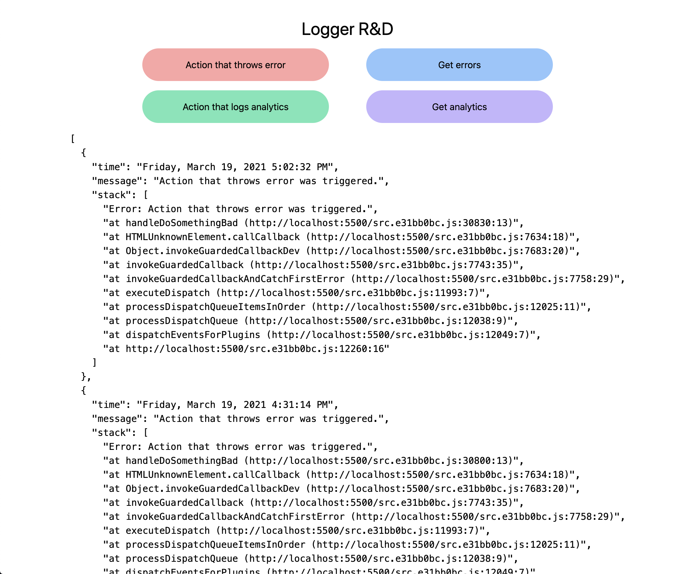
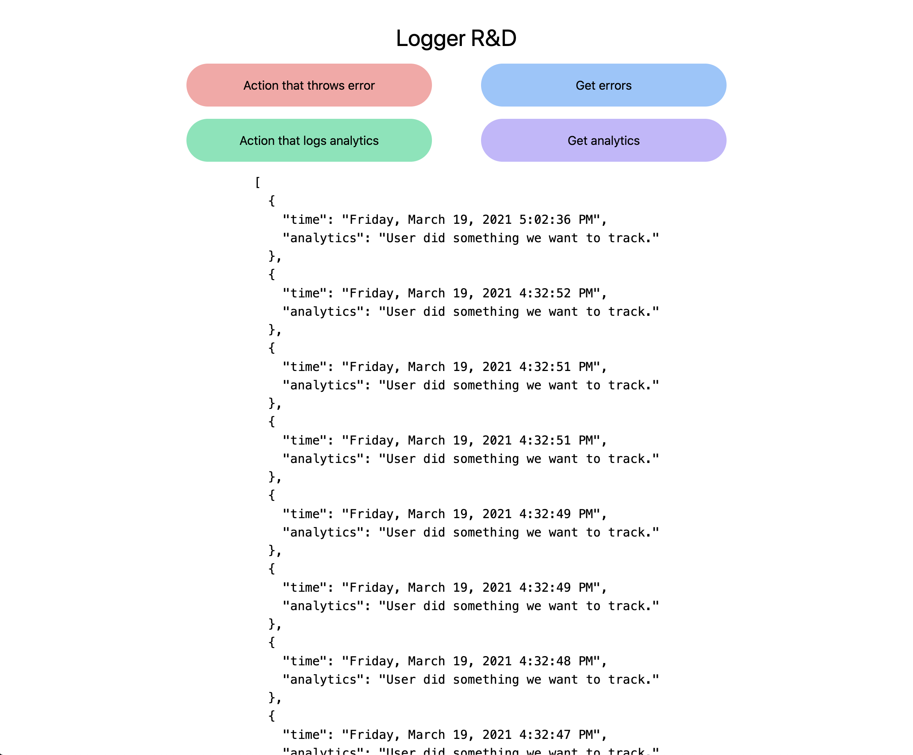

# Logger Example

Simulate throwing an error and it gets logged to an errors file as a JSON object.

Simulate a user interaction you want to track and it gets logged to an analytics file as a JSON object.

## Errors

## Analytics

# How to run locally

- After cloning, install npm packages

  - `npm install`

- Use parcel-bundler to watch for frontend changes

  - `npm run watch`

- Use nodemon to watch for backend changes

  - `npm run startDev`
